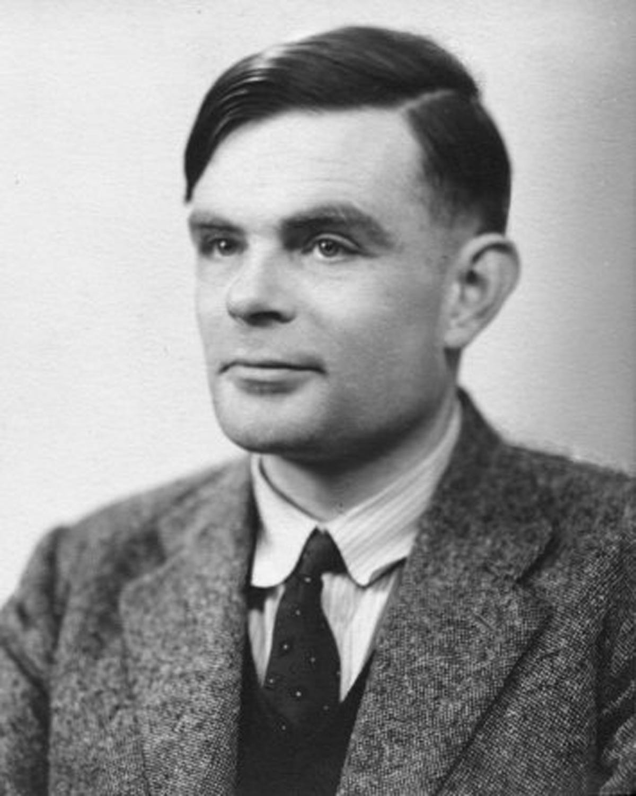

## A New Look at Data Engineering


Provide solutions for companies to build their software faster, cheaper, and with better quality. <!-- .element: class="fragment" -->


## What would *New* look like?
Faster, cheaper, and with better quality. <!-- .element: class="fragment" -->


## Why spend time thinking about solutions that don't exist yet?


### Broken Window Fallacy


> "...Your theory has stopped at what is seen and takes no account of what is not seen."
>
> -- <cite>Claude Frederic Bastiat (1801-1850)</cite>


## What is Data Engineering?


## Engineering...


## Plumbing...


## Etymology


## Engineer
  - create <!-- .element: class="fragment" -->
  - clever <!-- .element: class="fragment" -->
  - contrive <!-- .element: class="fragment" -->
  - construct <!-- .element: class="fragment" -->
  - engine/machine <!-- .element: class="fragment" -->
  - creator/designer of engines of war <!-- .element: class="fragment" -->


## Plumber
  - surname <!-- .element: class="fragment" -->
  - worker in lead <!-- .element: class="fragment" -->
  - 19c. workman who installs pipes and fittings <!-- .element: class="fragment" -->


## What is data engineering?

Creating an engine/machine that can manipulate data through time and space <!-- .element: class="fragment" -->


## Mechanic


## Mechanic etymology
  - inventive <!-- .element: class="fragment" -->
  - ingenious <!-- .element: class="fragment" -->
  - handicraft worker <!-- .element: class="fragment" -->


## Physics enables creativity


## What would be the "physics" of data engineering?

- Language Features <!-- .element: class="fragment" -->
- Patterns <!-- .element: class="fragment" -->
- Reading the manual <!-- .element: class="fragment" -->


# NOPE!


## The "physics" of data engineering

- Category theory <!-- .element: class="fragment" -->
- Type theory <!-- .element: class="fragment" -->
- Proof theory <!-- .element: class="fragment" -->


## What is the dream data engine?
- Domain expert playground
- Tinkering <--= Production
- Performant and scalable


## Current Solutions


## Pandas
- pros
  - most pleasant API
  - python batteries included concept
- cons
  - limited in distributed computing
  - memory management / streaming


##  Spark
- pros
  - Excellent support for distributed computing
  - Excellent support for streaming
  - support for optimization / memory management
- cons
  - optimizations / memory management is difficult
  - API has a lot of unnecessary cruft


## DSLs vs General Purpose Languages


## History



## Designing our DSL
- ~define~ discover your grammar
- represent your grammar as a data type (AST)
- perform various transformations on that AST


## Example Data Engine DSL
```lang-haskell
data Type = RecordType (Map String Type)
          | IntType
          | StringType
          | BoolType

data DataSource = DataSource Type String

data Term = RunTranform DataSource Term
          | DropColumn Int
          | SumColumn Int
          | IntTerm Int
          | StringTerm String
          | BoolTerm Bool
```


## Example App

```lang-haskell
exampleApp :: Term
exampleApp =
  let
    schema = RecordType (fromList [ ("foo", IntType)
                                  , ("bar", StringType)
                                  ])
    dataSrc = DataSource schema "./test.csv"
  in RunTransform dataSrc (DropColumn 2)
```


## Code generation
```lang-haskell

customImpl :: Term -> String
customImpl = ...

pandasImpl :: Term -> String
pandasImpl = ...

sparkImpl :: Term -> String
sparkImpl = ...
```


## Contact


whitehead@onepunchtech.xyz
